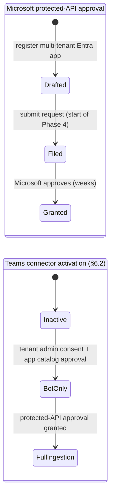

# Development Plan — Enterprise MCP Server

Execution tracker for the blueprint in `product-idea.md`. That document is the source of truth for
**what** the system is and **why** (all `§` references below point into it); this file tracks **in what
order** we build it and **how we know each step is done**. Update checkboxes and the status line as work
progresses.

The server is a Java 17+ / Spring Boot 3 MCP server that exposes tools, resources, prompts, and a
grounded RAG pipeline to any AI client (Claude Desktop, Claude Code, IDE MCP extensions,
ChatGPT, Claude Desktop, any MCP client) over the MCP protocol. AI clients do the synthesis; the server
keeps retrieval grounded and cited, and actions deterministic, approval-gated, and auditable. A
first-party **Web UI** (§5.8) rides the same services: a SharePoint-like files & folders manager, a
connectors console (upload a Postman collection → tools named `{app}_{request-name}`), and a Chat page
(persistent, client-side conversation history) where plain-text messages run RAG search and `#keyword`
invocations run tools deterministically (e.g. `#todo_app_create_todo "Need to meet chairman"`).

**Delivery rule:** every phase completes a runnable **end-to-end flow** — input at one edge, verified
output at the other — and exits only when its **E2E test checklist** passes. No phase ships as a
disconnected horizontal layer.

**Direction:** ship the **MCP server end to end on an open-source stack** first (in-process ONNX embedding
+ reranking, Caffeine cache, embedded SQLite + sqlite-vec + FTS5, SQLite-based durable event queue —
all running as native processes, **no Docker or virtualization for now**); **Microsoft Teams**
(protected-API) and other proprietary
integrations are sequenced into Phase 4. **Authentication and access control land as the final phase
(Phase 6)** — by explicit decision; until Phase 6 exits, the server runs **only on trusted internal
networks** and is never exposed publicly. ACL tags are *captured* on every chunk from Phase 2 so that
Phase 6 only has to switch enforcement on — no re-ingestion.

### Early delivery — API dashboards and query grammar

- [x] **RQL / `.rqd` vertical slice** — imported, enabled GET API tools can be queried through
  `POST /api/reports/analyze`, `POST /api/reports/execute`, and `POST /api/dashboards/data`; the
  `/dashboards` workspace provides live diagnostics plus `Stat`, accessible `BarChart`, and
  `DataTable` views. It remains intentionally read-only and does not change the phase exit criteria.

---

## 1. Phase state diagram

```mermaid
stateDiagram-v2
    direction LR

    [*] --> P1

    state "Phase 1 · Foundation" as P1
    state "Phase 2 · Knowledge & Search" as P2
    state "Phase 3 · Enterprise Actions" as P3
    state "Phase 4 · Integrations" as P4
    state "Phase 5 · Production" as P5
    state "Phase 6 · Auth & Access Control" as P6
    state "Operate & Scale" as OPS

    P1 --> P2: AI client connects and calls a tool — fully traced
    P2 --> P3: grounded, cited context returned — ACL tags captured on every chunk
    P3 --> P4: state-changing tool runs preview → approve → execute → audited
    P4 --> P5: Jira/Confluence/SharePoint + zero-code onboarding live
    P5 --> P6: HA, scaling, monitoring, DR in place
    P6 --> OPS: authN/authZ + ACL enforcement live — cleared for exposure beyond trusted networks
    OPS --> [*]
```

### External dependency track — Microsoft approvals (filed at the start of Phase 4)

---

## 2. Master checklist (one line per phase)

- [ ] **Phase 1** — an AI client connects to the MCP server over Streamable HTTP and calls a basic tool
  end to end, fully traced (trusted internal network; no auth until Phase 6)
- [ ] **Phase 2** — an AI client request returns grounded, cited context from ingested enterprise
  content, every chunk carrying captured ACL tags
- [ ] **Phase 3** — a state-changing tool runs through preview → approve (confirmation token) → execute
  and is fully audited
- [ ] **Phase 4** — Jira/Confluence/SharePoint integrations are live and an unseen API onboards by file
  upload
- [ ] **Phase 5** — the server runs horizontally scaled with monitoring, DR, and backups in place
- [ ] **Phase 6** — authentication, RBAC/ABAC, ACL enforcement, and the confused-deputy guard are live;
  the server is cleared for exposure beyond trusted networks

## 3. Detailed plan per phase

### Phase 1 — Foundation (§2, §3, §5.3)

**Goal:** a running MCP server that an AI client can connect to and call a tool on, with OpenTelemetry
tracing and an evaluation baseline from the start. No authentication yet (Phase 6) — trusted internal
network only.

**E2E flow:** an AI client (e.g. Claude Desktop or a test MCP client) connects to the server over
Streamable HTTP → calls a basic read tool → gets a structured, schema-validated response — every step
visible as one connected OpenTelemetry trace.

Build checklist:
- [ ] Spring Boot 3 + Java 17+ project skeleton (`mcp-server/` module structure from §4)
- [ ] Java MCP SDK integration; MCP server over **Streamable HTTP** (SSE transport avoided — deprecated);
  stateless mode (or externalized session mapping) from the start so replicas need no session affinity
- [ ] Server binds to localhost / trusted internal interfaces only (**no auth until Phase 6** — guardrail)
- [ ] PostgreSQL deployment; pgvector extension enabled; base schema (chunks, audit, workflow state,
  connections) with ACL-tag columns, tsvector column (lexical leg), embedding column sized for the pinned
  model (nomic-embed-text-v1.5, 768-dim), HNSW index
- [ ] Basic read tools registered (e.g. `ping`, `whoami`, a stub `search-knowledge-base`) with JSON Schema
  I/O; runtime tool mutation verified (`addTool` / `removeTool` / `notifyToolsListChanged`)
- [ ] OpenTelemetry tracing wired in from the start — every MCP request and tool call spanned
- [ ] Golden-set evaluation harness: ~50 real queries (search queries with relevant doc IDs; action queries
  with expected tool + params) in `eval-harness/golden-set/`; search metrics (P@K, MRR, NDCG) and action
  metrics (tool match, param accuracy) scoring any pipeline implementing the `SearchPipeline` /
  `AnswerPipeline` seams; regression gate
  - [x] Retrieval slice: 50 judged search queries, P@1/MRR/nDCG@10 report, versioned thresholds, and
    a failing regression gate (`scripts/run-eval.sh`)
  - [ ] Action-query/tool-parameter slice
- [x] CI pipeline: backend tests + retrieval golden-set regression gate and browser-native frontend syntax/smoke checks on every
  change (GitHub Actions, no Docker)
- [ ] Maven build producing a single runnable JAR; scripted **native local stack** — natively installed
  PostgreSQL + pgvector and Jaeger/OTEL collector binaries — with start/stop scripts
  (**no Docker or virtualization** — environment constraint)
- [~] **Deferred to Phase 4.** Register the multi-tenant Entra app and file the Microsoft protected-API
  request; start this track when Teams/Phase 4 work begins.
- [~] **Deferred to Phase 6.** Spring Security, OAuth2/JWT validation, Keycloak OIDC, and the MCP
  authorization spec — the entire auth stack lands as the final phase.

E2E test checklist:
- [ ] AI client lists tools, calls a read tool, receives a schema-valid response
- [ ] One command runs the golden set and emits a scored report (`scripts/run-eval.sh` →
  `eval-runs/<run-id>/report.json`); a deliberately degraded stub makes the regression gate fail (exit 1)
- [ ] CI fails on a deliberately introduced regression (gate wired into the pipeline)
- [ ] Every harness run produces traces; a single query can be followed span-by-span from input to score
- [ ] Golden set and scores are versioned; two runs on the same input produce comparable reports
- [ ] Runtime tool add/remove is picked up by the next client `tools/list` without a restart
- [ ] Server is unreachable from outside the trusted network segment (bind/firewall verified)
- [~] *(Deferred to Phase 6)* Unauthenticated / invalid-JWT MCP call rejected
- [~] *(Deferred to Phase 4 Teams track)* Protected-API request submitted with tracking reference

### Phase 2 — Knowledge & Search (§2.2, §5.6, §5.7, §6.1, §6.3)

**Goal:** AI clients get grounded, cited context from enterprise knowledge — first real value. ACL tags
are **captured** on every chunk (enforcement activates in Phase 6).

**E2E flow:** a page is created/edited in Confluence, Jira, or SharePoint → webhook or delta poll picks it
up → durable event queue (SQLite `ingestion_events` table) → ingestion pipeline → ACL-tagged, embedded
chunks appear in the SQLite chunk store within minutes → an AI client requests context for a query →
hybrid search (vector + lexical, RRF-merged)
→ cross-encoder rerank → cited context payload returned. Also: an admin uploads a PDF and the AI client
gets cited context from it minutes later.

Build checklist:
- [ ] File Manager: structure-aware chunking (headings / speaker turns / ticket fields / Tika for Office
  docs; 500–1000 token chunks with overlap)
- [ ] Embedding integration: pinned default **nomic-embed-text-v1.5 (768-dim, long-context — 500–1000
  token chunks fit)** exported to ONNX, run **in-process** via ONNX Runtime + HuggingFace tokenizer (DJL)
  inside the server JVM; provider-swappable via the `EmbeddingClient` seam
- [ ] **Hybrid search:** pgvector cosine over the HNSW index + PostgreSQL FTS lexical leg (`ts_rank` —
  not true BM25; ParadeDB `pg_search` is the upgrade path if BM25 ranking proves necessary), merged via
  **Reciprocal Rank Fusion (RRF)**; the `userAclTags` filter parameter is plumbed through the search seam
  but passes all tags until Phase 6
- [ ] **ACL capture:** every chunk tagged at ingestion with ACL metadata derived from the source system —
  never deferred, on every intake path
- [x] Cross-encoder reranker **in-process** (`ms-marco-MiniLM-L6-v2` ONNX, same ONNX Runtime setup):
  top-N hybrid candidates re-scored
- [ ] Context builder: cited context (excerpt + source title + URL + combined score + provenance) — no
  answer text generated by the server
- [ ] MCP resources exposed (documentation, PDFs, SOPs, wiki, code snippets, config); ACL tags carried on
  every resource (gating activates in Phase 6)
- [x] Confluence connector: Cloud + Server/DC detection, CQL delta polling, webhook registration
  (Server/DC only — Cloud webhook registration needs a Connect/Forge app, so Cloud relies on
  polling), backfill. Known gap: delta polling alone can't detect deletes (Confluence's
  content-search API doesn't emit tombstones) — only a Server/DC webhook's page-removed event
  purges reliably. `connectors/ConfluenceConnector.java`
- [x] Jira connector: Cloud + Server/DC detection, JQL delta polling, webhook registration
  (Server/DC only, same Cloud limitation as Confluence), backfill, update-in-place.
  `connectors/JiraConnector.java`
- [ ] **SharePoint connector** — deferred (no Microsoft Graph/Entra tenant available to build
  against). `ConnectionType`/`SourceConnector` reserve a `SHAREPOINT` slot so adding it later
  doesn't require rearchitecting the connectors subsystem. Still spec'd here as
  (Microsoft Graph — standard permissions, no protected-API approval):
  - Entra ID app registration: `Sites.Read.All`, `Files.Read.All`, `Lists.Read.All` for ingestion
  - Content ingestion: modern pages, document libraries (Tika extraction), SharePoint Lists, OneNote
  - Change detection: Graph delta queries (store `@odata.deltaLink`); optional webhooks on
    `driveItem` / `listItem`
  - ACL mapping: site permission groups + item-level overrides captured; broken inheritance respected
  - Backfill crawler; update-in-place and delete propagation
  - Graph subscription renewal scheduler + lifecycle-notification endpoint
- [x] **Durable event queue** between webhook receipt and processing: SQLite `ingestion_events` table
  (single-worker claim — no `SKIP LOCKED` needed given the embedded single-JVM store; replay
  PENDING/PROCESSING rows on startup; dead-letter status column; 3-second SLA on webhook ack, satisfied
  at intake by `ConnectionController` inserting the row and returning immediately). Kafka (KRaft, native
  install) remains the documented scale-up path if throughput demands it. Supersedes the original
  Postgres-outbox design — see `DECISIONS.md`.
- [ ] **Web UI slice 1 — Files & Folders (§5.8):** SharePoint-like manager — folder tree, drag-and-drop
  upload (PDF/Office/Markdown), replace-with-versioning, personal document space (`owner` column;
  `user:<username>` ACL tag), folder-level visibility captured as ACL tags; admin document management
- [x] **Web UI slice 1 — Chat (RAG):** turn-based chat page — plain-text messages retrieve cited
  knowledge-base results with the existing search pipeline. Conversation history is client-side only
  (`localStorage`), capped at 25 conversations and 50 turns per conversation, individually
  selectable/deletable, so prior searches stay available instead of being replaced. RAG and web evidence is
  collapsed by default into separate counts; users can expand the evidence and then individual RAG files.
  `#`/`@` tool invocations remain the pure deterministic action path. Browser-native HTML/CSS/JS
  lives directly in the JAR's static resources (no Node toolchain or separate web server).
- [x] Update/delete sync: edits replace chunks in place (same `source_file_id`); deletes purge via
  cascade. True for upload, Confluence, and Jira; SharePoint pending
- [ ] PII-redaction and retention policies per source, applied before embedding

E2E test checklist:
- [x] Create a Confluence page → ACL-tagged chunks present in the SQLite chunk store within the sync
  SLA (verified via WireMock'd Cloud API in `ConfluenceConnectorTests` + a live E2E pass against a
  local fake Confluence server: create connection → verify → backfill → confirm via `/api/search`);
  Server/DC path (auto-detected, polling) covered by `detectsServerDcDeploymentWhenCloudPathFails`
- [x] Create and edit a Jira issue → chunks appear, then update in place
  (`JiraConnectorTests#createThenEditSameIssueReplacesChunksInPlace`)
- [ ] Create a SharePoint page → ACL-tagged chunks appear within the sync SLA; upload a file to a doc
  library → Tika-extracted chunks indexed; create a list item → `field: value` chunks ingested
  — deferred with the SharePoint connector
- [ ] **ACL capture asserted:** SharePoint site permission groups and item-level overrides land as the
  expected tags on the chunks (enforcement tests run in Phase 6) — deferred with the SharePoint
  connector; Confluence/Jira ACL capture (connection/space/project-level tags) is asserted in
  `ConfluenceConnectorTests`/`JiraConnectorTests` and documented as a simplification in `DECISIONS.md`
- [x] Delete the source page/item → its chunks are purged from the vector store (webhook-driven purge
  tested in `ConfluenceConnectorTests#webhookPayloadPurgesChunksWhenPageNoLongerExists` and
  `JiraConnectorTests#webhookDeletedEventPurgesChunks`; connection-delete cascade verified live via
  `/api/search` before/after `DELETE /api/connections/{id}`)
- [x] Golden-set questions retrieve expected documents; P@1, MRR, and nDCG@10 meet the versioned
  baseline (`scripts/run-eval.sh`)
- [x] Exact-match query (ticket ID, acronym) retrieves correctly via the lexical leg
  (`ChunkRepositorySearchTests`)
- [ ] Upload a PDF → ask a question only it can answer → cited context appears within minutes; re-upload a
  changed PDF → new content in results, stale chunks gone
- [ ] Web UI: upload a file into a folder in the files manager → results appear on the universal search
  page with citations; folder visibility lands as ACL tags on the chunks (capture asserted)
- [ ] Query with no relevant corpus → zero results returned, no fabricated excerpts
- [x] Kill ingestion workers mid-burst, restart → no events lost (queue replay verified in
  `IngestionEventRepositoryTests#eventLeftProcessingByACrashIsRequeuedAndReclaimableAfterRestart`,
  which exercises exactly the claim → crash → `resetProcessingToPending` → reclaim sequence
  `EventQueueWorker` runs at startup)
- [ ] Multi-day soak: Graph subscriptions never lapse; renewal scheduler observable in traces
- [ ] Every step visible as one connected trace from webhook receipt to context returned
- [x] Golden-set retrieval baseline recorded and wired as a CI regression gate
- [~] *(Deferred to Phase 6)* ACL negatives: user B cannot retrieve content they lack permission for;
  SharePoint item-level override limits retrieval to permitted users

### Phase 3 — Enterprise Actions (§7, §9, §10)

**Goal:** governed, auditable, approval-gated actions — the deterministic workflow engine, audit log,
metrics, rate limiting, and caching. The workflow's GUARD step is built as a pluggable seam now and
activated with real entitlements in Phase 6.

**E2E flow:** an AI client invokes a state-changing tool (e.g. `jira_create_ticket`) — or a user types
`#todo_app_create_todo "Need to meet chairman"` in the Web UI search bar — → parameter extraction →
JSON Schema validation → guard seam (pass-through until Phase 6) → preview rendered with a single-use
confirmation token → client confirms with the token (Approve button in the UI) → execute with idempotency
key → audit log entry → confirmation returned. A rejected/expired token produces no side effects.

Build checklist:
- [ ] **Deterministic workflow engine:** named, versioned state machine per state-changing tool —
  EXTRACT → VALIDATE → GUARD → PREVIEW → EXECUTE → CONFIRM; multi-step clarification via state machine
- [ ] **Authorization guard seam:** the GUARD step calls a pluggable `EntitlementChecker`; pass-through
  implementation until Phase 6 activates the confused-deputy guard (§5.2)
- [ ] Parameter extraction engine: admin-configured templates (regex + JSONPath); missing fields trigger
  template-rendered clarification prompts
- [ ] **Approval gates (preview → confirmation token):** state-changing tools return a structured preview
  carrying a **single-use, expiring confirmation token**; execution happens only when the client calls the
  paired confirm tool with that token (MCP elicitation used where the client supports it); read tools
  execute freely
- [ ] **Idempotency keys** on all create operations
- [ ] **Audit log** of every tool invocation: actor, arguments, result, timestamp; queryable in the Admin
  Console (actor = client-declared identity until Phase 6 binds verified identity)
- [ ] **Rate limiting** per tool and per client/connection
- [ ] **Caffeine in-process cache:** short-TTL response cache for live-retrieval tools and hot query
  results (Valkey is the scale-up path when multiple replicas need a shared cache)
- [ ] **Metrics:** MCP requests, tool execution time, search latency, error rates, cache hit ratio, DB
  performance, user activity (Prometheus + Grafana)
- [ ] **Prompt injection protection:** structured, schema-bound tool/resource responses; delimited,
  quoted retrieval context with provenance labels (ingested content is attacker-writable);
  admin-controlled tool descriptions
- [ ] **Web UI slice 2 — `#keyword` actions (§5.8):** `#<app>_<request-name> "primary argument"` grammar
  parsed deterministically in the universal search bar; keyword autocomplete after `#`, grouped by app;
  read tools render results inline; state-changing tools render the preview card with Approve/Reject
  wired to the confirmation token; clarification prompts inline
- [ ] Single-tenant deployment posture (settled — revisit only with a concrete multi-tenant requirement)
- [ ] Admin Console — **minimal slice:** tool/workflow approval + audit log query. Full console
  (connection management, extraction template editor, ingestion health, retention/PII policies, cost and
  evaluation dashboards) staged across Phases 4–5
- [~] *(Deferred to Phase 6)* RBAC/ABAC, document-level permission enforcement, confused-deputy guard
  activation, IP allowlists

E2E test checklist:
- [ ] `jira_create_ticket` (stubbed downstream in this phase) → param extract → validate → guard seam →
  preview + token → confirm with token → execute (stub) → confirm; full audit entry written
- [ ] Web UI: `#todo_app_create_todo "Need to meet chairman"` in the search bar → preview card → Approve
  → stubbed execute → confirmation card; Reject produces no side effects (audited); `#` autocomplete
  lists tools grouped by app
- [ ] Confirm without a token / with an expired or reused token → no execution; audited
- [ ] Reject the preview → no execution; audit log records the rejection
- [ ] Force a retry around a create → exactly one execution (idempotency key verified)
- [ ] Read tool executes with no approval prompt; write tool never executes without one
- [ ] Rate limit exceeded → request rejected with a structured error; cache hit serves a repeated
  live-retrieval tool within TTL
- [ ] Workflow state survives a backend restart
- [ ] Required parameter missing from the tool call → clarification prompt; user supplies value; workflow
  resumes
- [ ] Golden-set action questions scored (tool match, param accuracy); Phase 2 retrieval baseline still
  passes
- [~] *(Deferred to Phase 6)* Confused-deputy block, RBAC denial, ACL negative on resource reads

### Phase 4 — Integrations (§6.1, §6.2, §8, §11)

> **Pulled forward (2026-07-13, see DECISIONS.md):** the §8 zero-code onboarding slice landed early —
> `API_COLLECTION` connections import Postman v2.x / Swagger 2.0 / OpenAPI 3.x specs (file or URL, Swagger-UI-page
> resolution included), generate `{app}_{request-name}` tools (GETs auto-enabled, writes pending
> approval), expose them over a real MCP endpoint (`/mcp`, Streamable HTTP, runtime addTool/removeTool)
> and the Web UI `#`/`@app` grammar with auto-generated inline argument forms, and support
> knowledge-source marking of GET endpoints (scheduled invoke → RAG ingestion). Still open from that
> checklist: extraction-template stubs/editor, per-tool rate-limit *configuration* UI (a default limit
> exists), config-driven crawling (Method 2 field mapping), and true sandboxed execution. The Phase 3
> `#keyword` grammar item is likewise done, minus the confirmation-token workflow engine (§7.2) — write
> tools use a preview→Run card in the UI instead.

**Goal:** first-party integrations are live and any API-backed application onboards in minutes via file
upload. Microsoft Teams protected-API track filed at the start of this phase.

**E2E flows (two slices):**
1. **Zero-code onboarding:** admin uploads an OpenAPI spec/Postman collection → MCP tools +
   extraction templates auto-generated → admin approves and marks one GET endpoint as a knowledge source
   → AI client immediately invokes a live tool and gets cited context from synced content.
2. **First-party integrations:** AI client creates a real Jira ticket via `jira_create_ticket` against a
   live Jira instance; retrieves Confluence content; reads/writes SharePoint. Teams bot-only stage
   activates on tenant consent.

Build checklist:
- [ ] **Kick off deferred Microsoft approval track** — register the multi-tenant Entra app + file the
  protected-API request at the **start of this phase**
- [ ] Jira integration: read tools (search issues, get issue) + write tools (create/update issue, comment)
  wired to live Jira; dedicated agent account; ACL tags captured from Jira project/role permissions
- [ ] Confluence integration: read tools (search/get page) + write tools (create/update page, comment);
  ACL tags captured from space restrictions
- [ ] SharePoint integration: write tools (upload/update file, create/update list item, create page) —
  all approval-gated; reuses the Phase 2 ingestion Entra app
- [ ] GitHub integration: repo/issue/PR operations; GitLab (optional)
- [ ] Kubernetes operations (list/restart pods, scale deployments); Docker management; ServiceNow; Jenkins
- [ ] **Zero-code onboarding (§8):** Postman (v2.1.0/draft-07) + OpenAPI 3.x parsers → JSON Schema per
  endpoint → tools named **`{app}_{request-name}`** (request name slugified as the default keyword,
  admin-editable) → MCP tools registered *pending*; admin reviews extraction templates, classifies
  read/write, sets rate limits, approves
- [ ] Auto-generated extraction template stubs (regex/JSONPath from request schema); admin-editable
- [ ] Self-correction loop: schema-violating payloads return a structured error; no retry by the server
- [ ] Sandbox execution for generated tools; host allowlist; per-tool rate limits
- [ ] Knowledge-source marking of GET endpoints: field mapping, sync schedule, dry-run preview
- [ ] Config-driven API crawling (Method 2): pagination, incremental sync, deletion propagation,
  HTML→Markdown
- [ ] Inbound webhook intake (Method 3): HMAC + timestamp replay protection, dead-letter queue
- [ ] Watched locations (Method 4): S3 / SharePoint / network share
- [ ] Azure Bot Service Teams bot (bot-only stage): mention handling, Entra ID identity passthrough
  plumbing, in-thread replies, Adaptive Card approvals (where a Teams channel surface is desired)
- [ ] **Web UI slice 3 — Connectors console (§5.8):** import wizard (Postman/OpenAPI upload → generated
  tool list with `{app}_{request-name}` names, editable), tool approve/disable, knowledge-source marking,
  extraction template editor, per-connection ingestion health (staged expansion continues into Phase 5)

E2E test checklist — first-party integrations:
- [ ] AI client calls `jira_create_ticket` against a live Jira → real ticket created under the agent
  account with "on behalf of @user" attribution; confirmation with ticket ID + URL
- [ ] AI client reads a Confluence page → content returned with ACL tags captured (gating activates in
  Phase 6)
- [ ] SharePoint write tool (upload file) → file appears in the doc library; approval gate enforced
- [ ] Reject the Jira preview → no ticket exists in Jira; audit log records the rejection
- [ ] Read tool executes with no approval prompt; write tool never executes without one
- [ ] All prior phases' E2E suites pass against live integrations
- [~] *(Deferred to Phase 6)* Confused-deputy test against live Jira: unentitled user blocked, audited

E2E test checklist — zero-code onboarding:
- [ ] Unseen API: spec upload → approved tools + knowledge sync → AI client invokes a live tool in
  minutes, no backend code
- [ ] Uploaded collection yields tools named `{app}_{request-name}` (e.g. `confluence_get_space_list`);
  the same tool invokes from an MCP client and via `#confluence_get_space_list` in the Web UI search bar
- [ ] Dry-run preview matches what the activated sync actually produces
- [ ] Invalid tool payload → structured error returned; no side effects
- [ ] Generated tool attempting a non-allowlisted host is blocked by the sandbox
- [ ] Webhook intake: valid HMAC upserts; bad signature rejected; replay rejected; malformed payload in
  DLQ
- [ ] Record deleted upstream → full-enumeration sync purges chunks within configured cycles
- [ ] Watched-folder sweep picks up new, changed, and removed files correctly

E2E test checklist — Teams channel:
- [ ] Bot-only stage works with tenant consent alone; ingestion clearly inactive until protected-API
  approval
- [ ] @agent mention → in-thread reply; mention text stripped
- [ ] Write request → Adaptive Card preview → Approve executes (audited, idempotent); Reject does nothing
- [ ] Full golden-set suite and all prior phases' E2E suites pass from the Teams channel once full
  ingestion is granted
- [~] *(Deferred to Phase 6)* Identity passthrough yields different results for users with different
  permissions

### Phase 5 — Production (§3, §10, §13)

**Goal:** production-grade — horizontally scalable, observable, recoverable. Still trusted-internal-network
only until Phase 6 exits.

**E2E flow:** the MCP server runs behind a load balancer with multiple replicas; a replica is killed
mid-traffic with no user-visible impact; Prometheus alerts fire on synthetic faults; a backup is restored
to a fresh cluster and serves correct results.

Build checklist:
- [ ] High availability: stateless server replicas behind a load balancer; PostgreSQL primary/replica
  (pgvector reads off replica where acceptable)
- [ ] Horizontal scaling: additional native JVM replicas behind the load balancer (service-manager
  managed, e.g. systemd); Kubernetes + autoscaling only if the virtualization constraint is lifted
- [ ] Streamable HTTP statelessness verified under load: any replica serves any request; no in-memory
  `Mcp-Session-Id` affinity
- [ ] Full monitoring: Prometheus + Grafana dashboards (MCP requests, tool execution time, search
  latency, error rates, cache hit ratio, DB performance, user activity); Loki/ELK structured logs
  correlated with OpenTelemetry traces
- [ ] Alerting on SLOs (search latency, tool error rate, ingestion lag, cache hit ratio)
- [ ] Disaster recovery: documented RPO/RTO; SQLite database file snapshot/point-in-time recovery;
  object storage replication
- [ ] Backup strategy: automated backups of the SQLite database (chunks, audit, workflow state,
  connections); tested restore drill (Keycloak realm backup joins in Phase 6)
- [ ] Secret management productionized (vault); encrypted configuration at rest
- [ ] Capacity planning and load tests against the golden set under realistic concurrency
- [ ] Runbooks: ingestion outage, Graph subscription lapse, embedding-model upgrade, degraded search
  response, native-service operations (Postgres/observability install, upgrade, restart procedures)
- [ ] Admin Console staged expansion completed: retention/PII policies, audit/cost dashboards, golden-set
  evaluation dashboard

E2E test checklist:
- [ ] Kill a replica mid-traffic → no failed MCP requests; load balancer drains and reroutes
- [ ] Prometheus alert fires within the SLO window on a synthetic search-latency fault
- [ ] Restore a PostgreSQL backup into a fresh cluster → same query returns the same ranked results
- [ ] Load test: N concurrent AI-client sessions sustain target latency; cache hit ratio and scaling
  behave as expected
- [ ] Embedding-model upgrade: re-embedding completes; golden-set regression passes before cutover
- [ ] All prior phases' E2E suites pass in the production topology

### Phase 6 — Auth & Access Control (§5.1, §5.2, §9) — final phase

**Goal:** the server is fully secured and permission-aware. Authentication, authorization, ACL
enforcement, and the confused-deputy guard land here — switched on over the ACL tags captured since
Phase 2 (no re-ingestion). Exiting this phase clears the server for exposure beyond trusted networks.

**E2E flow:** an AI client discovers auth requirements via MCP protected-resource metadata → registers
dynamically → completes OAuth 2.1/PKCE against Keycloak → every MCP request carries a validated JWT →
user identity resolves to ACL tags that filter retrieval and resource reads → RBAC/ABAC gate tools →
the confused-deputy guard blocks unentitled actions → the audit log records the verified actor.

Build checklist:
- [ ] Spring Security + OAuth2 resource server: JWT validation on every MCP endpoint
- [ ] **MCP authorization spec:** OAuth 2.1 with PKCE, protected-resource metadata (RFC 9728),
  authorization-server discovery, dynamic client registration — verified against real AI clients
  (Claude, ChatGPT, IDE MCP extension connectors)
- [ ] Keycloak OIDC (native bare-JVM install) as default IdP; Admin/Manager/User realm roles;
  Entra ID / Okta pluggable seam
- [ ] API keys for headless / service-to-service clients
- [ ] **RBAC** (Admin/Manager/User) + **ABAC** (connection/team/department attributes) enforced on tool
  invocation and resource reads
- [ ] **Document-level ACL enforcement switched on:** hybrid search and resource reads gated by
  `acl_tags && userAclTags` (tags captured since Phase 2); filtered-ANN recall protected via
  oversampling / pgvector iterative index scans and re-baselined against the golden set
- [ ] **Confused-deputy guard activated** in the workflow GUARD seam (pass-through until now): per-user
  entitlement check before every EXECUTE; dedicated agent service account with "on behalf of @user"
  attribution
- [ ] Per-user audit attribution: verified identity replaces client-declared identity in the audit log
- [ ] Rate limiting re-keyed per authenticated user (extends Phase 3 per-client limits)
- [ ] **IP allowlists** for internal-only admin endpoints
- [ ] Web UI login via Keycloak (OIDC); RBAC/ACL enforcement applied to search results, files & folders,
  `#keyword` actions, and the connectors console
- [ ] Keycloak realm config added to the backup strategy; tested restore drill
- [ ] Admin Console: user/role management (Keycloak OIDC)

E2E test checklist (includes all tests deferred from earlier phases):
- [ ] Unauthenticated / invalid-JWT MCP call rejected *(from Phase 1)*
- [ ] A real AI client completes the full MCP auth handshake: metadata discovery → dynamic registration →
  OAuth 2.1/PKCE → authenticated tool call
- [ ] **ACL negative:** user B cannot retrieve content they lack permission for in the source system
  *(from Phase 2)*
- [ ] SharePoint item-level permission override → only permitted users retrieve that item's chunks
  *(from Phase 2)*
- [ ] ACL negative on resource reads: user B cannot read a resource their ACL tags don't permit
  *(from Phase 3)*
- [ ] RBAC: a User-role principal cannot invoke an Admin-only tool *(from Phase 3)*
- [ ] **Confused-deputy tests:** unentitled user blocked at the guard (stubbed and against live Jira);
  attempt audited *(from Phases 3–4)*
- [ ] Teams identity passthrough yields different results for users with different permissions
  *(from Phase 4)*
- [ ] Keycloak realm restore → users can sign in and retrieve with correct ACLs *(from Phase 5)*
- [ ] Golden-set regression passes **with ACL filtering enabled** (P@K, MRR, NDCG vs the Phase 2
  baseline; filtered-ANN recall mitigation verified)
- [ ] Web UI: sign-in required; two users with different permissions see different search results,
  file trees, and `#` autocomplete entries
- [ ] All prior phases' E2E suites pass with authentication enabled
- [ ] **Exit gate:** security review sign-off; server cleared for exposure beyond trusted networks

---

## 4. Cross-phase rules

- **E2E or it didn't ship:** a phase exits only when its E2E test checklist passes end to end.
- **Evaluation gates every phase:** the golden-set regression (Phase 1) runs at each phase boundary; a
  phase doesn't exit if it regresses search quality (P@K, MRR, NDCG) or action accuracy.
- **Observability is not a phase:** every component ships with OpenTelemetry tracing wired in from the
  start; metrics and dashboards arrive with Phase 3 and mature in Phase 5.
- **ACL capture is never deferred:** any new intake path must tag chunks with ACL metadata before its
  first merge. **Enforcement** of those tags is sequenced into Phase 6, where every capture path gets its
  ACL negative test.
- **Trusted-network guardrail (until Phase 6 exits):** the server has no authentication until the final
  phase — it binds only to localhost / trusted internal networks, is never exposed publicly, and this is
  verified in every phase's E2E run.
- **Stateless server:** the MCP server holds no in-memory session state; Streamable HTTP runs in
  stateless mode (or session mapping is externalized) and workflow state is persisted so any replica can
  resume.
- **Separate business logic from MCP protocol handling:** services in `services/`/`repositories/` are
  reusable outside MCP; `mcp/` only adapts them to the protocol, and the Web UI is a REST channel over
  the same services — never a second implementation.
- **Every tool is an independent module** with a JSON Schema interface and its own tests.
- **Open-source-first:** the default stack is open source end to end — in-process ONNX embedding +
  reranking, Caffeine cache (Valkey at scale), Postgres-outbox eventing (Kafka at scale), embedded
  SQLite + sqlite-vec (pgvector at scale), Keycloak (Phase 6). Proprietary services (Microsoft
  Graph/Entra/Azure Bot) are deferred to Phase 4.
- **Native processes only (current constraint):** no Docker, Kubernetes, or other virtualization — the
  server is a single runnable JAR with in-process ML inference; PostgreSQL, observability, and (from
  Phase 6) Keycloak run as natively installed services. Containerization is revisited in Phase 5+ only if
  the constraint is lifted.
- **Settled decisions are not re-litigated:** MCP-over-Streamable-HTTP (stateless mode); deterministic
  workflow engine; preview → single-use confirmation-token approval flow; dedicated agent identity +
  confused-deputy guard (activated Phase 6); idempotency + audit; embedded SQLite + sqlite-vec
  (HNSW at scale via pgvector swap); hybrid search merged via RRF + cross-encoder rerank (ACL filter
  activates Phase 6); open-source-first stack; in-process ONNX inference (no Ollama, no sidecars);
  SQLite-based durable event queue (`ingestion_events` table, single-worker claim — supersedes the
  earlier Postgres-outbox design now that storage is embedded SQLite; Kafka at scale); Caffeine-first
  caching; single-tenant posture;
  `{app}_{request-name}` tool naming doubling as the Web UI `#keyword` grammar; the Web UI as a REST
  channel over the same services; **auth & access control as the final phase**.
