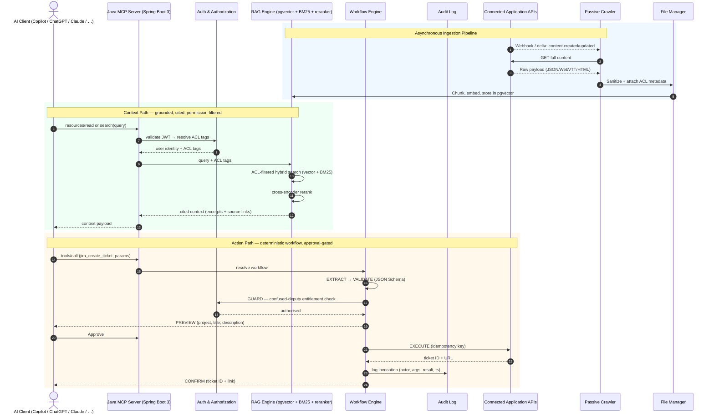

# Enterprise MCP Server — Architecture Blueprint and Development Plan

## 1. Vision

An **enterprise MCP (Model Context Protocol) server** that turns fragmented enterprise knowledge and
application APIs into a single, governed context layer for any AI client — GitHub Copilot CLI, VS Code
Copilot, Microsoft Copilot Studio, ChatGPT, Claude Desktop, or any MCP-compatible client.

The server is a Java 17+ / Spring Boot 3 service that speaks the MCP protocol directly. AI clients connect
to it and get three kinds of capabilities:

- **Tools** — callable actions in connected systems (look up a customer, run a SQL report, create a Jira
  ticket, restart a service, read logs) executed through deterministic, approval-gated workflows.
- **Resources** — exposed enterprise content (documentation, PDFs, SOPs, wiki pages, code snippets,
  configuration files) the client can read.
- **Prompts** — reusable enterprise prompt templates (incident analysis, root cause analysis, code review,
  SQL optimization, API documentation generation).

Retrieval is grounded and permission-aware: a **RAG pipeline** returns ACL-filtered, cited context to the
AI client, so every answer the client produces is traceable to a source the user is allowed to see. Actions
are deterministic and auditable: a **workflow engine** wraps state-changing tools with parameter
extraction, validation, a confused-deputy guard, approval previews, idempotency, and a full audit trail.

Alongside the MCP surface, a first-party **Web UI** (§5.8) gives humans the same capabilities directly:
a SharePoint-like **files & folders manager**, a **connectors** console (upload a Postman collection and
the application is wired — every request becomes a tool named `{app}_{request-name}`, e.g.
`confluence_get_space_list`), and a **universal search page** where plain keywords run RAG search and
`#`-prefixed keywords invoke tools deterministically (e.g. `#todo_app_create_todo "Need to meet
chairman"`) — fetch live data, perform actions, all without an LLM in the loop.

Three principles drive the design:

- **Ground, don't fabricate.** The server returns ranked, cited, permission-filtered context and exposes
  tools with clear contracts. The AI client synthesizes; the server keeps it anchored in enterprise
  reality the user is entitled to see.
- **Deterministic actions.** Tool selection by the AI client resolves to fixed, versioned, auditable
  workflows — no probabilistic parameter values, no unguarded side effects. State-changing tools are
  previewed and approved before execution.
- **Stateless, observable, secure by default.** The MCP server is stateless for horizontal scaling; every
  request, tool call, and retrieval is traced, metric'd, and audit-logged.

> **Source of truth.** This document is the source of truth for **what** the system is and **why** (all
> `§` references below point into it). The execution tracker lives in `plan.md`. Diagrams are embedded
> in both documents as Mermaid blocks.

## 2. High-Level Architecture

```
                AI Clients                      Web UI (first-party)
    ┌─────────────────────────────────┐   ┌───────────────────────────────┐
    │ GitHub Copilot CLI              │   │ Chat  (RAG, #keywords)         │
    │ VS Code Copilot                 │   │ Files & Folders   (SharePoint-│
    │ Microsoft Copilot Studio        │   │                    like)      │
    │ ChatGPT                         │   │ Connectors        (Postman /  │
    │ Claude Desktop                  │   │                    OpenAPI)   │
    │ Any MCP Client                  │   └──────────────┬────────────────┘
    └──────────────┬──────────────────┘                  │
                   │                                     │
              MCP Protocol                        REST (same services)
                   │                                     │
         ┌─────────▼─────────────────────────────────────▼──┐
         │ Java MCP Server                                  │
         │ Spring Boot 3                                    │
         └─────────┬────────────────────────────────────────┘
                   │
      ┌────────────┼────────────┐
      │            │            │
      ▼            ▼            ▼
 Authentication  Tool Engine   Resource Engine
 Authorization  Prompt Engine  RAG Engine
 Audit Logs     Workflow       Search Engine
                   │
          Business Services
                   │
     ┌─────────────┼──────────────┐
     ▼             ▼              ▼
 PostgreSQL    Object Storage   External APIs
 pgvector      Documents        Jira/GitHub/ERP
```

### 2.1 Request paths through the server

The MCP server handles two classes of client requests:

- **Context / retrieval path (Resources + RAG):** the AI client requests context for a query. The server
  embeds the query, runs a **hybrid search** (lexical + pgvector, RRF-merged; ACL-filtered once Phase 6
  enforcement lands), applies a **cross-encoder reranker**, builds a cited context payload, and returns it. No answer text is generated by the server;
  the AI client synthesizes from the grounded, cited context.
- **Action path (Tools + Workflow):** the AI client invokes an MCP tool. The server runs the matching
  **deterministic workflow**: extract parameters → validate against the tool's JSON Schema →
  confused-deputy entitlement check → preview → (approval gate for state-changing tools) → execute with an
  idempotency key against the target system → confirm → audit-log.

The first-party **Web UI** (§5.8) drives the same two paths through REST controllers: plain-text messages
in Chat take the context path; `#keyword` invocations take the action path. The UI is a channel over the
same services, not a second implementation (§13).

### 2.2 Asynchronous knowledge accumulation

API-based and web-based **passive crawlers** continuously monitor connected systems via webhooks and
scheduled delta syncs. Captured content (Confluence pages, Jira tickets, SharePoint pages and document
libraries, Teams messages and meeting transcripts, uploaded documents) flows to a **File Manager** staging
layer, where it is sanitized, chunked, tagged with **ACL metadata** (who is allowed to see it), embedded
with an open-source embedding model, and stored in **pgvector**. This pathway feeds the RAG/search engine.

## 3. Technology Stack

**Stack posture — open-source-first.** The default stack is open source end to end (in-process ONNX
embedding + reranking, Keycloak SSO, Valkey cache, pgvector). Proprietary services (Microsoft Graph/Entra
for Teams chat content) are deferred to Phase 4 and bring the only proprietary, paid dependencies.

**Runtime posture — native processes only (current constraint).** Docker, Kubernetes, and any other
virtualization are **not available for now**: the server ships as a single runnable JAR; embedding and
reranking models run **in-process** via ONNX Runtime inside the server JVM (no sidecars); PostgreSQL,
Kafka, Valkey, Keycloak, and the observability services are natively installed processes. Containerization
is revisited in Phase 5 only if the constraint is lifted.

| Layer | Technology | Justification |
| --- | --- | --- |
| Language | Java 17+ | Java 17 LTS bytecode/API baseline; the same JAR runs on Java 17, 20, 21, and newer runtimes. |
| Framework | Spring Boot 3 | Portable, proven; direct JDBC to pgvector, explicit workflow state machines. |
| MCP SDK | Java MCP SDK | First-party SDK for MCP tool/resource/prompt registration and Streamable HTTP transport. |
| Database | PostgreSQL | Transactional store for chunks, audit log, workflow state, connections. |
| Vector search | pgvector (HNSW index) | Cosine similarity with ACL metadata filtering in SQL — one less system to operate. ACL-filtered ANN needs oversampling / iterative index scans (pgvector ≥ 0.8) to protect recall — verified against the golden set when enforcement lands (Phase 6). |
| Full-text search | PostgreSQL Full-Text Search (tsvector + `ts_rank`) | Enterprise jargon, ticket IDs, and acronyms defeat pure cosine; the lexical leg covers exact matches. `ts_rank` is **not** true BM25 — ParadeDB `pg_search` (native extension) is the upgrade path if BM25 ranking proves necessary. |
| Hybrid search | pgvector cosine + PostgreSQL lexical rank, merged via **Reciprocal Rank Fusion (RRF)** | Rank-based fusion combines the legs without mixing incomparable score scales. |
| Reranking | Open-source cross-encoder reranker (e.g. bge-reranker) exported to ONNX, run in-process via ONNX Runtime | Lifts retrieval quality; no sidecar, no external API — runs inside the server JVM. |
| Embeddings | Pinned default: **nomic-embed-text-v1.5 (768-dim)** exported to ONNX, run in-process via ONNX Runtime + HuggingFace tokenizer (DJL) | Long-context model — 500–1000-token chunks fit; no separate inference service; provider-swappable via the `EmbeddingClient` seam. |
| Cache | Caffeine (in-process); Valkey when multiple replicas need a shared cache | Short-TTL response cache for live-retrieval tools and hot query results — one fewer native service until scale demands it. |
| Security | Spring Security + OAuth2 + JWT + **MCP authorization spec** (OAuth 2.1/PKCE, RFC 9728 protected-resource metadata, dynamic client registration) | MCP endpoint protection, token validation, per-user identity for ACL-filtered retrieval. **Lands in Phase 6 (final phase)** — trusted internal networks only until then. |
| Identity & SSO | Keycloak (OIDC) default; Microsoft Entra ID / Okta pluggable | Open-source, self-hosted SSO; any OIDC/SAML IdP pluggable. Arrives with Phase 6. |
| Event queue | PostgreSQL outbox/event table (`SKIP LOCKED` workers); Kafka (KRaft, native) at scale | Decouples webhook receipt from processing with replay and dead-lettering — no extra service to operate until throughput demands Kafka. |
| Build | Maven | Standard Java build, dependency management, multi-module. |
| Runtime | Native JVM processes — single runnable JAR | **No Docker or virtualization for now** (environment constraint); embedding + reranker inference runs inside the server JVM, backing services installed natively. |
| Orchestration | Load-balanced native JVM replicas; Kubernetes deferred | Horizontal scaling via multiple stateless replicas behind a load balancer; Kubernetes revisited in Phase 5 only if virtualization is permitted. |
| Monitoring | OpenTelemetry + Prometheus + Grafana | Tracing + metrics for routing, retrieval, reranking, workflow steps, and MCP calls. |
| Logging | Loki or ELK | Centralized structured logs correlated with traces. |
| API docs | OpenAPI / Swagger | Generated REST surface docs for admin/management endpoints. |
| Web UI | React + TypeScript SPA, built to static assets and served from the Spring Boot JAR | Files & folders manager, connectors console, universal search with `#keyword` actions — no separate web server process (native-only constraint). |
| Transport | MCP over Streamable HTTP | Open standard; runtime tool mutation. (SSE transport is deprecated in the MCP spec.) |

## 4. Project Structure

```
mcp-server/
│
├── auth/
├── config/
├── controllers/
├── mcp/
│   ├── tools/
│   ├── prompts/
│   ├── resources/
│   └── handlers/
├── rag/
│   ├── embedding/
│   ├── retrieval/
│   ├── reranker/
│   └── chunking/
├── services/
├── repositories/
├── models/
├── security/
├── workflow/
├── audit/
├── cache/
├── monitoring/
└── webui/          (React SPA source — built into the JAR's static resources)
```

Each top-level directory is an independently testable module. MCP protocol handling (`mcp/`) is kept
separate from business logic (`services/`, `repositories/`) so services can be reused outside MCP
(§13 design principles).

## 5. Core Modules

### 5.1 Authentication

> **Sequencing.** Authentication and access control are deliberately the **final phase** (Phase 6, §12):
> until it exits, the server runs unauthenticated on **trusted internal networks only** and is never
> exposed publicly. The mechanisms below describe the end state; ACL tags are captured from Phase 2 so
> Phase 6 only switches enforcement on.

- **OAuth2** — standard authorization-code and client-credentials flows for users and AI-client
  integrations.
- **MCP authorization spec** — OAuth 2.1 with PKCE, protected-resource metadata (RFC 9728),
  authorization-server discovery, and dynamic client registration, so off-the-shelf AI clients (Claude,
  ChatGPT, Copilot Studio) connect without custom configuration.
- **JWT** — validated on every MCP request; carries the user identity used for ACL-filtered retrieval and
  per-user authorization.
- **API Keys** — for service-to-service and headless AI-client integrations.
- **SSO** — Microsoft Entra ID, Okta, and any OIDC/SAML IdP; Keycloak as the default open-source broker.

### 5.2 Authorization

- **Role-Based Access Control (RBAC)** — Admin / Manager / User roles gate admin-console and tool-pack
  access.
- **Attribute-Based Access Control (ABAC)** — connection, team, and department attributes refine
  entitlements.
- **Document-level permissions** — every chunk carries ACL tags derived from the source system,
  **captured at ingestion from day one (Phase 2)**; once enforcement activates in Phase 6, the user's
  identity filters every retrieval — **users only retrieve chunks they are permitted to see in the source
  system** — with no re-ingestion needed for the cutover.
- **Confused-deputy guard** — the server operates in each connected system as a **dedicated agent service
  account** whose permissions may exceed a given user's. The server enforces **per-user authorization
  before every tool execution**, so the agent never performs an action the requesting user isn't entitled
  to, even though its own account could. The requesting user is captured in the audit log and stamped into
  the content (e.g. *"created on behalf of @ajay via MCP Server"*).

### 5.3 MCP Tools

Tools are the action surface exposed to AI clients. Each tool is an independent module with a clear
interface (JSON Schema for inputs/outputs), registered with the Java MCP SDK and runtime-mutable
(`addTool()` / `removeTool()` / `notifyToolsListChanged()`) — no restarts when an admin approves or removes
a workflow.

**Naming convention:** every tool id is `{app-name}_{request-name}` in lowercase snake case (e.g.
`confluence_get_space_list`, `jira_create_ticket`, `todo_app_create_todo`). Imported tools derive
`request-name` from the Postman/OpenAPI request name by default (§8, admin-editable). The tool id doubles
as the invocation keyword in the Web UI's `#` grammar (§5.8), so one name works identically for AI
clients and humans.

Example tool catalogue:

- Search knowledge base (delegates to the RAG pipeline)
- Execute SQL reports
- Customer lookup / order lookup
- Restart service
- Create Jira ticket
- GitHub operations
- Kubernetes operations
- Docker management
- Read logs

State-changing tools are wrapped by the deterministic workflow engine (§7); read tools execute freely.

### 5.4 MCP Resources

Resources expose enterprise content the AI client can read directly:

- Documentation
- PDFs
- Standard operating procedures (SOPs)
- Wiki pages
- Code snippets
- Configuration files

Resources are sourced from the same ingestion pipeline as the RAG index and carry the same ACL metadata —
a resource is only visible to a user whose ACL tags permit it.

### 5.5 MCP Prompts

Reusable, parameterized enterprise prompt templates the AI client can invoke:

- Incident analysis
- Root cause analysis
- Code review
- SQL optimization
- API documentation generation

Prompt templates are admin-managed, versioned, and audited; they are deterministic text templates, not
generated content.

### 5.6 RAG Pipeline

The retrieval pipeline that grounds AI-client answers in permission-filtered enterprise reality:

```
User Query
      │
      ▼
Permission Check        (user identity → ACL tags; enforcement activates in Phase 6)
      │
      ▼
Hybrid Search           (lexical + pgvector, RRF-merged, ACL-filtered)
      │
      ▼
Reranking               (cross-encoder reranker)
      │
      ▼
Context Builder         (top-N chunks + citations + provenance)
      │
      ▼
Return Context to AI Client
```

1. **Permission check** — the authenticated user's identity resolves to ACL tags used to filter every
   downstream step (tags are captured from Phase 2; enforcement activates in Phase 6).
2. **Hybrid search** — pgvector cosine similarity (HNSW) + PostgreSQL lexical rank, merged via
   **Reciprocal Rank Fusion (RRF)**, gated by `acl_tags && userAclTags` once enforcement is on.
3. **Reranking** — a cross-encoder reranker re-scores the top-N hybrid candidates for final ordering.
4. **Context builder** — assembles cited context (excerpt + source title + URL + score + ACL-verified) and
   provenance metadata (connection, source endpoint or file, fetch time).
5. **Return** — context is returned to the AI client; no answer text is generated by the server.

Retrieved chunks are returned as **cited context** — the excerpt is the chunk content itself, highlighted
around the query terms, with a link to the live source page, ticket, or transcript the user is permitted to
see.

### 5.7 File Management, Embeddings, and the Search Index

1. The File Manager normalizes and sanitizes raw text, then applies **structure-aware chunking**: Confluence
   and SharePoint pages split by headings, transcripts by speaker turns, tickets and list items by field,
   SharePoint documents via Tika extraction — targeting 500–1000 token chunks with overlap.
2. Each chunk is embedded with the pinned **open-source embedding model** (default:
   nomic-embed-text-v1.5, 768-dim) run in-process via ONNX Runtime and persisted in pgvector (HNSW index)
   with metadata: source system, source URL/ID, timestamp, and **ACL tags**.
3. PII-redaction and retention policies are applied per source **before embedding**.
4. Re-embedding management supports embedding-model upgrades without re-ingestion.

### 5.8 Web UI

A first-party web application, served as a static SPA bundle from the runnable JAR (no extra process —
native-only constraint), driving the same business services the MCP layer adapts (§13). Three surfaces:

- **Files & Folders** — a SharePoint-like document manager: folder tree, drag-and-drop upload
  (PDF/Office/Markdown/HTML/TXT/CSV), replace-with-versioning, personal space, folder-level visibility
  (captured as ACL tags). Everything uploaded flows through the same ingestion pipeline (§5.7) and is
  searchable minutes later.
- **Connectors** — wire an application by uploading its Postman collection or OpenAPI spec (§8): review
  the auto-generated tools (named `{app}_{request-name}`), edit names and extraction templates, approve
  or disable tools, mark GET endpoints as knowledge sources, and watch ingestion health per connection.
- **Chat** — a persistent conversation thread over one input box. History is kept **client-side only**
  (browser `localStorage`, no server-side chat storage, no cross-device sync), so prior turns stay visible
  as new ones are added rather than being replaced:
  - **Plain-text messages** → RAG-grounded retrieval: the Chat page calls `GET /api/search` and renders
    the returned cited sources directly. It does not send prompts or retrieved excerpts to an external
    answer-generation backend. The MCP context path stays retrieval-only.
  - **`#` keyword invocation** → deterministic tool routing: `#<app>_<request-name> "primary argument"`
    (e.g. `#todo_app_create_todo "Need to meet chairman"`) resolves the named tool directly — no
    classifier, no LLM. Read tools execute immediately and render results; state-changing tools render
    the workflow preview card (§7.2) with Approve/Reject; missing parameters produce inline clarification
    prompts. Tool keywords autocomplete after `#`, grouped by app.

Keycloak login, RBAC, and ACL enforcement reach the Web UI with Phase 6; until then it is reachable on
the trusted internal network only (§9).

## 6. Passive Ingestion

### 6.1 Confluence, Jira, and SharePoint

- Confluence and Jira ingest via their native webhooks plus scheduled delta syncs. Both connectors support
  Cloud and Server/Data Center: provisioning auto-detects version and deployment type, registers webhooks
  programmatically where credentials permit, and falls back to CQL/JQL delta polling.
- **SharePoint** is a first-class connector using the Microsoft Graph API with **standard** application
  permissions (`Sites.Read.All`, `Files.Read.All`, `Lists.Read.All` for ingestion; `Files.ReadWrite.All`,
  `Sites.ReadWrite.All` for write actions) — **no Microsoft protected-API approval required** (unlike Teams
  chat content).
  - Content types: modern + classic pages (`/sites/{id}/pages`), document libraries
    (`/drives/{id}/root/children` → Tika extraction), SharePoint Lists (`/lists/{id}/items` as
    `field: value` text), OneNote pages (`/sites/{id}/onenote/pages`).
  - Change detection: Graph delta queries (store `@odata.deltaLink` per list/library); optional Graph
    webhook subscriptions on `driveItem` / `listItem` for near-real-time updates.
  - ACL mapping: site permission groups (Owners/Members/Visitors) + item-level permission overrides fetched
    at sync time; broken inheritance respected.
- A separate **backfill crawler** performs the initial historical import for every newly connected source.
- **Update/delete sync:** edits replace chunks in place (same `external_id`); deletes purge via cascade.
- **Subscription lifecycle:** Graph subscriptions expire quickly — a renewal scheduler and a
  lifecycle-notification endpoint are mandatory (shared by SharePoint and Teams).

### 6.2 Microsoft Teams (deferred; proprietary)

Teams message and transcript ingestion uses Microsoft Graph with **application permissions**
(`Chat.Read.All`, `OnlineMeetingTranscript.Read.All`). Application-level access to Teams chat content is a
Microsoft **protected API** — the approval request must be filed early; it can take weeks (see the
external dependency track in `plan.md` §1). The 3-second webhook SLA applies: the endpoint returns `202 Accepted` and enqueues; async workers fetch
full content and parse WebVTT transcripts.

### 6.3 Generic application ingestion

Every other connected application feeds the knowledge base through a **generic ingestion framework** with
four intake methods chosen per source during connection setup.

| Content type | Examples | Method |
| --- | --- | --- |
| Current-state records | ticket/order status, inventory, schedules | **Method 1:** live tool retrieval — no ingestion |
| Document-shaped text | KB articles, runbooks, policies, FAQs | **Method 2:** API crawling → embed |
| Push-capable content | apps that emit webhooks on publish/change | **Method 3:** webhook intake → embed |
| Offline / no usable API | PDFs, Office docs, exports | **Method 4:** upload / watched location → embed |

- **Method 1 — Live retrieval via tools (default, zero ingestion):** imported GET endpoints are registered
  as read-class tools; the workflow engine calls them at request time. Data is always current; per-user
  authorization is enforced at call time. A short-TTL response cache (per endpoint, 30–300 s) absorbs
  repeated requests.
- **Method 2 — Config-driven API crawling:** configured entirely in the import wizard; no code. The admin
  marks endpoints as knowledge sources and supplies a mapping config: endpoint selection, field mapping
  (JSONPath-style: `content`, `title`, `url`, `external_id`, `updated_at`), pagination strategy, sync
  schedule, incremental sync (`since`/content hash), deletion propagation, HTML→Markdown, and a dry-run
  preview.
- **Method 3 — Inbound webhook intake (push):** each connection exposes
  `POST /ingest/hooks/{connection-id}` with HMAC signature verification and timestamp replay protection.
  Malformed or unmappable payloads land in a dead-letter queue inspectable from the Admin Console.
- **Method 4 — Document upload and watched locations:** console upload (PDF, Office, Markdown, HTML, TXT,
  CSV) and watched locations (S3 bucket, SharePoint document library, or network share). Re-uploading a
  file versions it atomically.
- **ACLs and governance:** visibility is set at the connection level (everyone / selected teams / selected
  roles) and applied as ACL tags to every chunk; individual sources can narrow further. Every chunk carries
  provenance metadata which surfaces as a citation in retrieval results.

## 7. Deterministic Action & Workflow Engine

### 7.1 Parameter extraction

Each workflow has an admin-configured **extraction template**: a set of named fields with regex and/or
JSONPath patterns. Fields that cannot be extracted trigger a structured **clarification prompt**
(template-rendered, not generated) asking the AI client/user to supply the missing value. There is no LLM
inference in this step.

### 7.2 Workflow engine

A workflow is a named, versioned, deterministic graph of steps that wraps a state-changing MCP tool:

1. **Extract** parameters (§7.1).
2. **Validate** against the tool's JSON Schema (rejects malformed inputs before any API call).
3. **Guard** — confused-deputy entitlement check via the user's identity in the request context (§5.2).
   Built as a pluggable seam from Phase 3; pass-through until Phase 6 activates enforcement.
4. **Preview** — render the action preview using a template (project, title, description, etc.) and
   return it to the AI client as a structured result carrying a **single-use, expiring confirmation
   token**. Approval = the client calls the paired confirm tool with that token (MCP elicitation is used
   where the client supports it); a missing, expired, or reused token executes nothing.
5. **Execute** — on a valid confirmation token, call the target system with an **idempotency key**;
   record the invocation in the audit log.
6. **Confirm** — render a structured confirmation (e.g. ticket ID + link) and return it to the AI client.

If the user rejects the preview, the workflow halts and records a `REJECTED` audit entry. No side effects
occur. Multi-step interactions are driven by the workflow state machine, not by a conversational LLM; each
turn carries the workflow's current state and the server resumes the in-flight workflow.

## 8. Zero-Code Tool Onboarding (Postman / OpenAPI)

1. An admin uploads the application's Postman collection (v2.1.0/draft-07) or OpenAPI 3.x spec.
2. The parser iterates endpoints, extracting method, URL, headers, and body structure, and auto-generates a
   formal **JSON Schema** per endpoint.
3. Each endpoint is assigned the tool id **`{app-name}_{request-name}`** (§5.3): the app name comes from
   the connection, the request name is slugified from the collection's request title (e.g. Confluence's
   "Get Space List" → `confluence_get_space_list`). The request name is the default keyword for
   understanding and invoking the tool — in AI clients and in the Web UI's `#` grammar alike —
   admin-editable before approval.
4. An **enrichment step** (admin-editable) writes descriptions and extraction template stubs — the admin
   reviews and refines the regex/JSONPath patterns in the console.
5. Each endpoint becomes an MCP tool registered in *pending* state until approved, then exposed via
   `McpSyncServer.addTool()`.
6. **Self-correction loop:** if a tool call emits a payload violating the generated schema, execution halts
   and the validation error is returned to the AI client as a structured error.
7. **Knowledge-source marking:** in the same import flow, the admin can flag GET endpoints as knowledge
   sources — one upload configures both actions (tools) and search (RAG ingestion via Method 2).

## 9. Security

> **Sequencing note.** The authentication/authorization items below land in **Phase 6 (final phase,
> §12)**. Until Phase 6 exits, the server runs only on trusted internal networks, bound to internal
> interfaces, and is never exposed publicly — this guardrail is verified in every phase's E2E run.

- **TLS everywhere** — all MCP, DB, and integration traffic encrypted in transit.
- **JWT validation** + **OAuth2** on every MCP endpoint; unauthenticated/unauthorized calls rejected.
- **Rate limiting** — per-tool and per-client limits.
- **IP allowlists** where appropriate (e.g. internal-only admin endpoints).
- **Audit logging** — every tool invocation: actor, arguments, result, timestamp; queryable in the Admin
  Console.
- **Secret management** — per-connection credentials in a vault; the dedicated agent account is the only
  identity stored per connection.
- **Encrypted configuration** — secrets and sensitive config encrypted at rest.
- **Input validation** — every tool input validated against its JSON Schema before execution.
- **Prompt injection protection** — tool/resource responses are structured and schema-bound; retrieval
  context is clearly delimited; tool descriptions are admin-controlled, not client-controlled.
- **Ingested-content injection defense** — enterprise content is attacker-writable (a wiki page can carry
  instructions aimed at the AI client): retrieved excerpts are returned as delimited, quoted context with
  provenance labels — never as instructions — and sanitization strips active content at ingestion.
- **Sandboxed tool execution** — dynamically generated tools execute in a sandbox isolated from the core
  application, restricted to an allowlist of reachable hosts, with per-tool rate limits.

## 10. Observability

Track from the start (OpenTelemetry traces + Prometheus metrics + Loki/ELK logs):

- MCP requests (count, latency, per-client/per-tool breakdown)
- Tool execution time
- Search latency (embed → hybrid search → rerank → context build)
- LLM latency (where the AI client surfaces it back to the server via telemetry)
- Error rates (per tool, per integration)
- Cache hit ratio
- Database performance
- User activity (retrievals, tool invocations, approvals/rejections)

## 11. Future Integrations

The server is designed to integrate with:

- GitHub · GitLab · Jira · Confluence · ServiceNow · Jenkins
- Kubernetes · Docker
- PostgreSQL · MySQL · Oracle
- Microsoft 365 · Slack · Microsoft Teams

First-party plug-and-play connectors ship for Jira, Confluence, and SharePoint; every other API-backed
application onboards via zero-code Postman/OpenAPI import (§8).

## 12. Development Roadmap

Delivery is organized as vertical slices — something user-visible ships from Phase 2 onward. **Every phase
completes a runnable end-to-end flow and exits only when its E2E test checklist passes.** The detailed
checklist per phase lives in `plan.md`.

| Phase | Objectives and deliverables | Outcome |
| --- | --- | --- |
| **Phase 1: Foundation** | Spring Boot 3 + Java 17+ setup; MCP server implementation (Java MCP SDK, Streamable HTTP, stateless mode); basic tools; PostgreSQL + pgvector integration (HNSW, ACL-tag columns); OpenTelemetry tracing, CI, and a golden-set evaluation baseline from the start. No auth (Phase 6) — trusted internal network only. | A running MCP server that an AI client can connect to and call a tool on, fully traced. |
| **Phase 2: Knowledge & Search** | Document ingestion; structure-aware chunking; embeddings (in-process ONNX, nomic-embed-text-v1.5); lexical full-text leg; RRF hybrid search; cross-encoder reranking (in-process ONNX); Postgres-outbox event queue; ACL tags **captured** on every chunk (enforcement in Phase 6); cited RAG context returned to AI clients; MCP resources exposed; **Web UI slice 1** — Chat page (persistent client-side history + RAG) + files & folders manager. | AI clients and the Web UI get grounded, cited context from enterprise knowledge. |
| **Phase 3: Enterprise Actions** | Deterministic workflow engine with approval gates (preview → single-use confirmation token) and idempotency; authorization guard seam (activated in Phase 6); audit logs; metrics; rate limiting; Caffeine caching; minimal admin-console slice; **Web UI slice 2** — `#keyword` tool invocation with preview/approve cards and inline clarification. | Governed, auditable, approval-gated actions — from AI clients and the search bar alike. |
| **Phase 4: Integrations** | GitHub; Jira; Confluence; Kubernetes; Docker; Microsoft 365 (incl. SharePoint); zero-code Postman/OpenAPI onboarding (`{app}_{request-name}` tools); **Web UI slice 3** — connectors console with the import wizard. Microsoft Teams protected-API track filed at the start of this phase. | Any API-backed application onboards in minutes; first-party integrations live. |
| **Phase 5: Production** | High availability; horizontal scaling; load balancing; full monitoring (Prometheus + Grafana + Loki/ELK); disaster recovery; backup strategy; orchestration as load-balanced native JVM replicas (Kubernetes only if the virtualization constraint is lifted). | Production-grade, horizontally scalable, observable, recoverable. |
| **Phase 6: Auth & Access Control** (final) | Spring Security OAuth2 + JWT; **MCP authorization spec** (OAuth 2.1/PKCE, RFC 9728 resource metadata, dynamic client registration); Keycloak OIDC (Entra ID/Okta pluggable); API keys; RBAC + ABAC; document-level ACL enforcement switched on over the tags captured since Phase 2; confused-deputy guard activated; per-user audit attribution; Keycloak login for the Web UI (RBAC/ACL applied to search, files, and connectors); IP allowlists. | Fully secured and permission-aware; cleared for exposure beyond trusted networks. |

## 13. Design Principles

- **Stateless MCP server** for easy scaling — Streamable HTTP runs in stateless mode (or session mapping
  is externalized); workflow state is persisted, not held in memory.
- **Separate business logic from MCP protocol handling** so services can be reused outside MCP.
- **Treat every tool as an independent module** with a clear interface (JSON Schema) and its own tests.
- **Keep retrieval (RAG), authentication, and integrations as separate components** to simplify testing and
  maintenance.
- **Use asynchronous processing** for long-running operations (ingestion, backfills, large tool calls).
- **Build comprehensive logging and metrics from the start** — observability is not a phase.
- **ACL capture is never deferred** — any new intake path tags chunks with ACL metadata before its first
  merge; enforcement of those tags activates in Phase 6, where every capture path gets its ACL negative
  test.
- **Auth & access control land last (Phase 6)** — by explicit decision: the server runs on trusted
  internal networks only until the final phase exits; day-one ACL capture keeps that cutover cheap.
- **Open-source-first** — proprietary services are the exception, deferred and isolated.

### Sequence diagram



## 14. Conclusion

This blueprint delivers an enterprise MCP server that is grounded, deterministic, and auditable: the
passive ingestion pipeline keeps the index anchored in current, permission-filtered enterprise reality,
while the RAG pipeline returns ranked, cited context to any AI client. The MCP tool surface, fed by
zero-code Postman/OpenAPI onboarding and driven by a deterministic workflow engine, lets AI clients act on
any application with an API with full predictability — previewed, approved, idempotent, and audit-logged.
Stateless, observable, and secure by default, the server scales horizontally and meets enterprise
governance requirements from day one.
